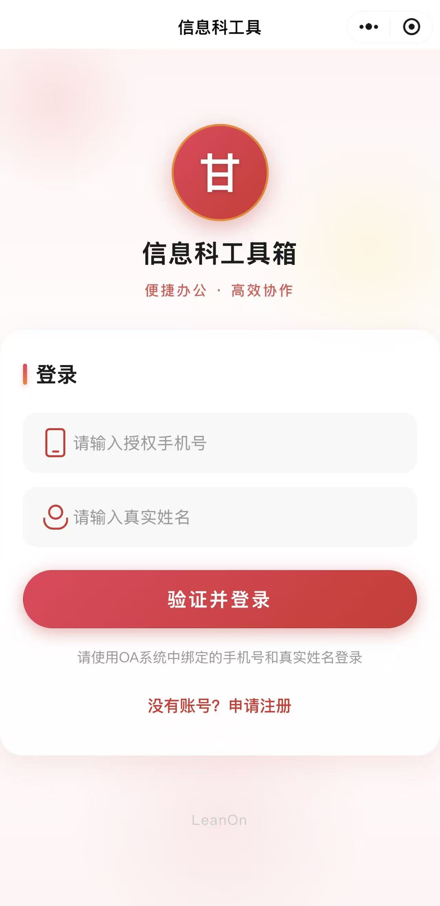
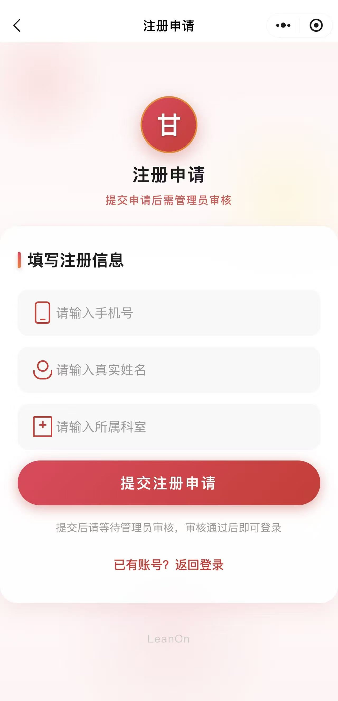
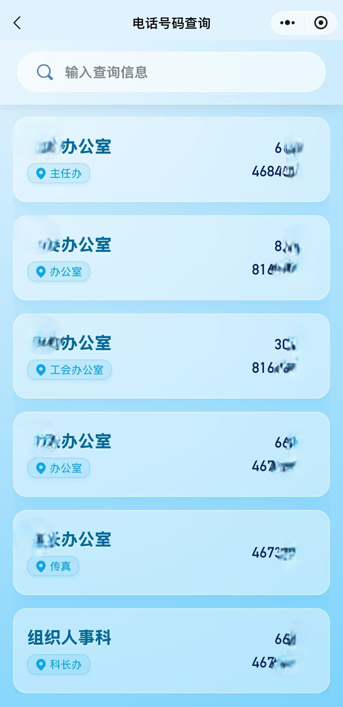
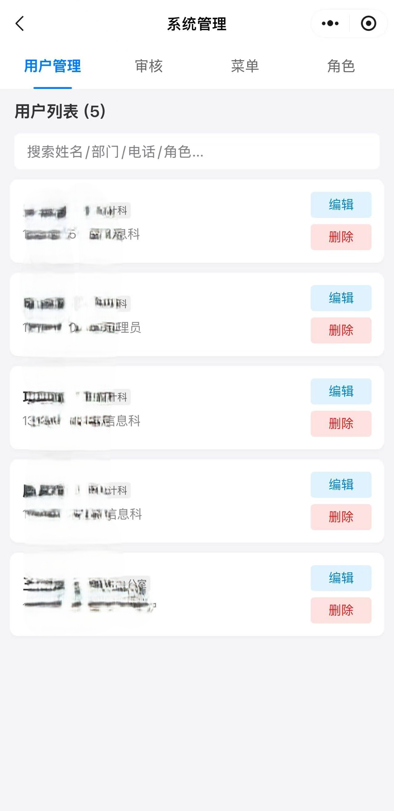
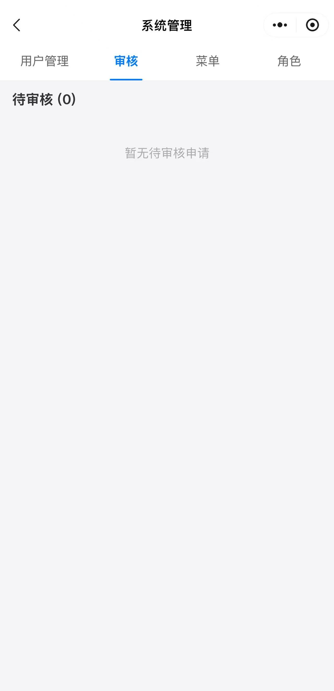
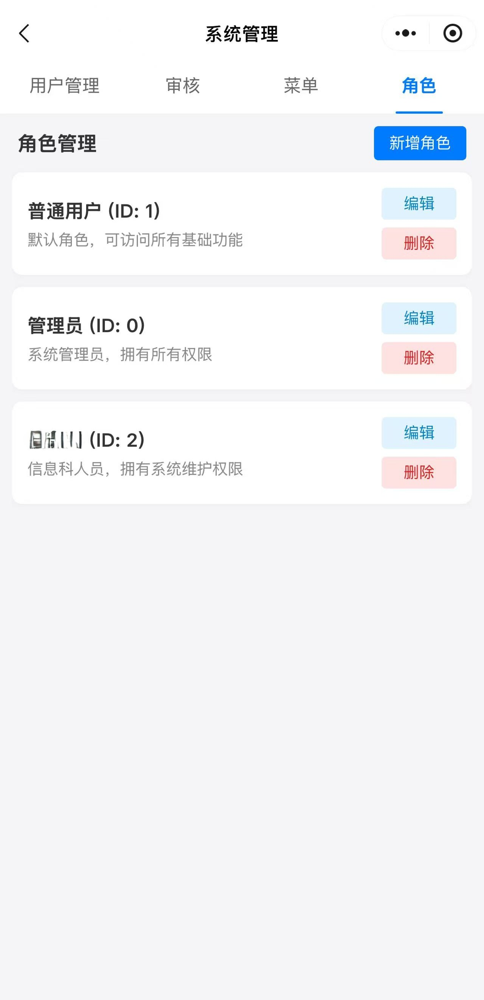
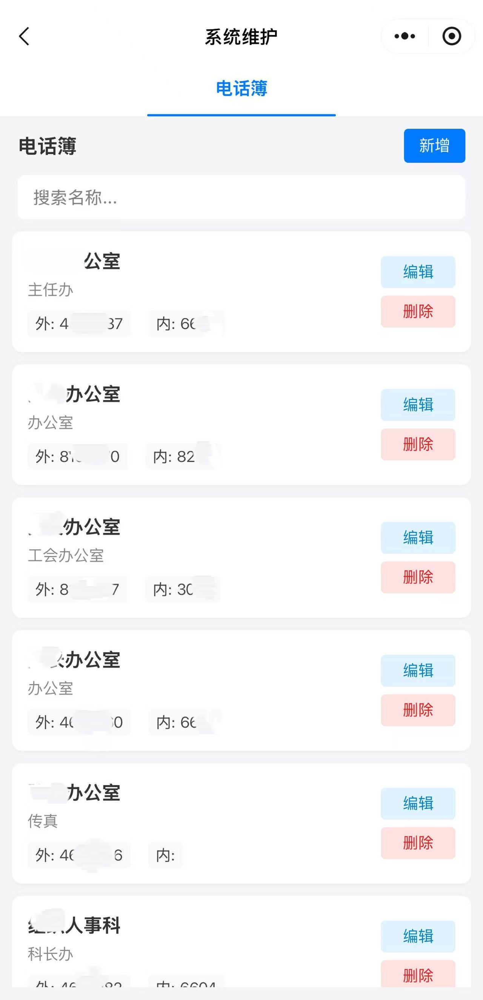

# Wechat Convex - 微信小程序 + Convex 后端模板

[English](#english) | [中文](#中文)

---

## 中文

### 项目简介

本项目是一个基于**微信小程序**和 **Convex** 后端的全栈应用模板。项目展示了如何将微信小程序与 Convex 云后端无缝集成，包含完整的用户认证、数据 CRUD、后台管理等功能。

**主要功能:**
- 用户登录/注册（微信 OpenID 绑定）
- 电话簿管理（示例 CRUD 模块）
- 后台管理系统（用户、角色、菜单管理）
- 基于菜单的细粒度权限控制（RBAC）
- 完整的安全防护机制（数据脱敏、自我操作防护、统一错误处理）
- 自定义 HTTP API 路由

### 技术栈

**前端 (小程序)**
- 微信小程序原生开发 (WXML, WXSS, JavaScript)
- 现代 CSS 设计（毛玻璃效果、节日主题）

**后端 (Convex)**
- [Convex](https://www.convex.dev/) - 实时后端平台
- TypeScript
- 自定义 HTTP 路由
- Schema 数据验证

### 界面截图

| 登录页 | 注册页 | 首页 |
| :---: | :---: | :---: |
|  |  |  |

| 电话簿 | 用户管理 | 注册审核 |
| :---: | :---: | :---: |
|  |  |  |

| 角色管理 | 菜单管理 | 电话簿维护 |
| :---: | :---: | :---: |
|  |  |  |

---

### 快速开始

#### 1. 环境准备

确保已安装：
- [Node.js](https://nodejs.org/) (v18+，推荐 LTS 版本)
- [微信开发者工具](https://developers.weixin.qq.com/miniprogram/dev/devtools/download.html)
- Convex 账号 ([注册地址](https://www.convex.dev/))

#### 2. Convex 后端部署

```bash
# 1. 进入 Convex 目录
cd weapp-convex

# 2. 安装依赖
npm install

# 3. 登录 Convex (首次使用)
npx convex login

# 4. 创建项目并启动开发服务器
npx convex dev
# 首次运行会提示创建新项目，输入项目名称后自动生成 .env.local

# 5. 记录你的 Convex URL (格式如: https://your-project-name.convex.site)
# 可在 Convex Dashboard 或 .env.local 中查看
```

#### 3. 设置环境变量 (Convex Dashboard)

在 [Convex Dashboard](https://dashboard.convex.dev/) 中设置以下环境变量：

| 变量名 | 说明 |
|--------|------|
| `WECHAT_APP_ID` | 微信小程序 AppID |
| `WECHAT_APP_SECRET` | 微信小程序 AppSecret |

路径: Dashboard > 你的项目 > Settings > Environment Variables

#### 4. 初始化数据库

```bash
# 确保在 weapp-convex 目录下
npx convex run init:initAll
```

这将创建默认的角色、菜单和示例数据。

#### 5. 配置微信小程序

1. 复制 `miniprogram/config.example.js` 为 `config.js`
2. 编辑 `config.js`，填入你的 Convex URL（格式: https://your-project-name.convex.site）
3. 编辑 `project.config.json`，将 `appid` 改为你的微信小程序 AppID

#### 6. 启动小程序

1. 打开微信开发者工具
2. 导入 `miniprogram` 目录
3. 编译并预览

#### 7. 首次登录与获取管理员权限

首次使用需要手动添加白名单用户并设置管理员权限：

**步骤 1: 添加白名单用户**

在 [Convex Dashboard](https://dashboard.convex.dev/) 的 Data 页面，找到 `allowedUsers` 表，点击 "Add document" 添加一条记录，填入你的手机号、姓名和部门信息。

**步骤 2: 登录小程序**

在小程序中使用微信手机号登录，登录成功后系统会在 `users` 表中创建用户记录。

**步骤 3: 设置管理员权限**

在 Convex Dashboard 的 `roles` 表中，找到 `roleId: 0` 的角色记录。该角色默认拥有所有权限。

在 `users` 表中，找到刚刚登录的用户记录，将 `roleId` 修改为 `0`。

**步骤 4: 重新进入小程序**

退出小程序后重新进入，即可在首页看到"系统管理"和"系统维护"菜单。

> **提示:** 权限系统基于菜单ID（menuId）进行细粒度控制。`roleId: 0` 的角色在代码中被特殊处理为拥有所有菜单权限。其他角色根据 `menuIds` 数组决定可访问的菜单。

---

### 项目结构

```
wechat_convex/
├── miniprogram/                # 微信小程序前端
│   ├── app.js                  # 小程序入口
│   ├── config.example.js       # 配置模板
│   ├── pages/
│   │   ├── home/               # 首页
│   │   ├── login/              # 登录页
│   │   ├── manager/            # 后台管理
│   │   └── telbook/            # 电话簿示例
│   └── utils/
│       └── request.js          # 请求封装
│
└── weapp-convex/               # Convex 后端
    ├── convex/
    │   ├── schema.ts           # 数据库 Schema
    │   ├── http.ts             # HTTP 路由
    │   ├── lib/
    │   │   └── auth.ts         # 权限验证工具库
    │   ├── auth.ts             # 认证逻辑
    │   ├── wechat.ts           # 微信登录
    │   ├── registration.ts     # 注册审核
    │   ├── telbook.ts          # 电话簿 CRUD
    │   ├── manager.ts          # 后台管理
    │   ├── menus.ts            # 菜单管理
    │   ├── banners.ts          # 轮播图管理
    │   └── init.ts             # 初始化脚本
    ├── scripts/                # 数据导入脚本
    └── .env.local.example      # 环境变量模板
```

---

### 示例模块: Telbook (电话簿)

Telbook 模块展示了完整的 CRUD 实现，可作为开发新模块的参考。

#### Schema 定义

**telbook 表字段：**
- `name`: 部门名称
- `remark`: 备注
- `outPhone`: 外线号码
- `inPhone`: 内线号码

#### Convex 函数 (`convex/telbook.ts`)

| 函数 | 类型 | 权限要求 | 说明 |
|------|------|----------|------|
| `getAllTelbook` | Query | menuId=10 | 获取所有电话记录（查看权限） |
| `searchTelbook` | Query | menuId=10 | 搜索电话记录 |
| `addTelbook` | Mutation | menuId=1 | 添加电话记录（维护权限） |
| `updateTelbook` | Mutation | menuId=1 | 更新电话记录（维护权限） |
| `deleteTelbook` | Mutation | menuId=1 | 删除电话记录（维护权限） |
| `batchImportTelbook` | Mutation | menuId=1 | 批量导入（最多1000条） |
| `clearTelbook` | Mutation | menuId=1 | 清空电话簿（记录数>10000时拒绝） |

#### HTTP 路由 (`convex/http.ts`)

```typescript
// GET /wx/telbook - 获取所有电话簿 (需要 menuId=10 权限)
// GET /wx/manager/telbook - 获取电话簿管理列表 (需要 menuId=1 权限)
// POST /wx/manager/telbook/create - 添加记录 (需要 menuId=1 权限)
// POST /wx/manager/telbook/update - 更新记录 (需要 menuId=1 权限)
// POST /wx/manager/telbook/delete - 删除记录 (需要 menuId=1 权限)
```

---

### 用户、角色与菜单系统

本项目实现了完整的**基于菜单的细粒度权限管理系统**（RBAC），包含用户管理、角色管理和动态菜单。

#### 权限系统架构

权限验证流程：`Token → User → Role → MenuIds → 权限判断`

**三级权限分级：**
| MenuId | 权限名称 | 说明 |
|--------|----------|------|
| 0 | 系统管理 | 用户管理、角色管理、菜单管理、审核管理、Banner管理 |
| 1 | 系统维护 | 电话簿增删改查 |
| 10 | 电话簿查看 | 仅查看电话簿列表 |

**安全特性 (v1.1.0+)：**
- ✅ **统一权限验证**：所有接口通过 `lib/auth.ts` 提供的 `requirePermission()` 验证权限
- ✅ **数据脱敏**：用户列表接口自动过滤 `token` 和 `openid` 敏感字段
- ✅ **自我操作防护**：用户无法修改自己的角色、删除自己的账号
- ✅ **管理员保护**：系统保护最后一个管理员，防止误删
- ✅ **批量操作限制**：批量导入/删除操作有数量上限（1000条/次）
- ✅ **统一错误处理**：所有错误信息完整传递到前端显示

#### 用户管理

系统包含三个用户相关的表：

| 表名 | 说明 |
|------|------|
| `allowedUsers` | 白名单表，只有在此表中的用户才能登录 |
| `pendingUsers` | 待审核用户表，新用户注册后进入此表等待审批 |
| `users` | 已登录用户表，存储 Token、OpenID 等信息 |

**用户注册流程:**
```
新用户注册 → pendingUsers (待审核)
     ↓ 管理员审批
allowedUsers (白名单) ← 审批通过
     ↓ 用户登录
users (已登录用户)
```

**核心字段：**
- `allowedUsers`: 白名单表（phoneNumber, name, department）
- `users`: 用户表（phoneNumber, token, openid, name, department, roleId）

> 详细 Schema 定义请查看 `convex/schema.ts`

#### 角色管理

角色用于控制用户可访问的菜单，每个角色关联一组菜单 ID。

**核心字段：**
- `roleId`: 角色 ID
- `name`: 角色名称
- `menuIds`: 可访问的菜单 ID 列表（权限控制核心）
- `isDefault`: 是否默认角色

**默认角色 (由 `init:initAll` 创建):**
| roleId | 名称 | menuIds | 说明 |
|--------|------|---------|------|
| 0 | 超级管理员 | [0, 1, 10] | 代码中特殊处理，拥有所有权限 |
| 1 | 普通用户 | [10] | 仅可查看电话簿 |

> **注意：** `roleId: 0` 在代码中被特殊处理（`auth.ts` 的 `requirePermission` 函数），无论其 `menuIds` 如何配置，都拥有所有菜单权限。

#### 菜单管理

菜单定义了首页显示的功能入口，支持动态配置。

**核心字段：**
- `menuId`: 菜单 ID（权限控制标识）
- `name`: 菜单名称
- `icon`: 图标路径
- `page`: 页面路径或目标小程序 AppID
- `type`: 类型（"page" 或 "miniprogram"）
- `sortOrder`: 排序顺序
- `isActive`: 是否启用

**菜单类型 (type) 说明:**

| type | 说明 | page 字段格式 |
|------|------|---------------|
| `page` | 小程序内部页面 | 页面路径，如 `/pages/telbook/telbook` |
| `miniprogram` | 跳转其他小程序 | 目标小程序的 AppID，如 `wx7ec43a6a6c80544d` |

> **获取其他小程序 AppID:** 在微信中打开目标小程序 → 点击右上角 `...` → 更多资料 → 复制 AppID

**菜单权限流程:**
```
用户登录 → 获取用户 roleId → 查询角色的 menuIds → 返回对应菜单列表
```

#### 管理后台 API

**用户管理 (需要 menuId=0):**
| 路由 | 方法 | 说明 |
|------|------|------|
| `/wx/manager/users` | GET | 获取所有用户（已脱敏） |
| `/wx/manager/users/update` | POST | 更新用户信息 |
| `/wx/manager/users/delete` | POST | 删除用户 |

**待审核用户管理 (需要 menuId=0):**
| 路由 | 方法 | 说明 |
|------|------|------|
| `/wx/manager/pending-users` | GET | 获取待审核用户 |
| `/wx/manager/pending-users/approve` | POST | 审批通过 |
| `/wx/manager/pending-users/reject` | POST | 审批拒绝 |

**角色管理 (需要 menuId=0):**
| 路由 | 方法 | 说明 |
|------|------|------|
| `/wx/manager/roles` | GET | 获取所有角色 |
| `/wx/manager/roles/create` | POST | 创建角色 |
| `/wx/manager/roles/update` | POST | 更新角色 |
| `/wx/manager/roles/delete` | POST | 删除角色 |

**菜单管理 (需要 menuId=0):**
| 路由 | 方法 | 说明 |
|------|------|------|
| `/wx/manager/menus` | GET | 获取所有菜单 |
| `/wx/manager/menus/create` | POST | 创建菜单 |
| `/wx/manager/menus/update` | POST | 更新菜单 |
| `/wx/manager/menus/delete` | POST | 删除菜单 |

**电话簿管理 (需要 menuId=1):**
| 路由 | 方法 | 说明 |
|------|------|------|
| `/wx/manager/telbook` | GET | 获取电话簿列表 |
| `/wx/manager/telbook/create` | POST | 创建电话记录 |
| `/wx/manager/telbook/update` | POST | 更新电话记录 |
| `/wx/manager/telbook/delete` | POST | 删除电话记录 |

---

### 权限验证实现

项目在 `convex/lib/auth.ts` 中提供统一的权限验证工具函数：

- `requireAuth()` - 验证 Token 是否有效
- `requirePermission()` - 验证用户是否有特定菜单权限
- `requireAdmin()` - 验证管理员权限（已弃用，建议使用 requirePermission）

所有 Convex 函数在执行业务逻辑前，使用这些工具函数进行权限验证。HTTP 路由层使用 `permAction` 中间件自动进行权限检查。

所有权限错误会自动捕获并以标准格式返回给前端：`{ success: false, message: "错误信息" }`

详细实现请参考代码中的注释和示例。

---

### 创建新模块流程

1. **定义 Schema** (`convex/schema.ts`) - 定义数据表结构
2. **创建 Convex 函数** (`convex/yourModule.ts`) - 实现业务逻辑
   - Query: 查询数据（使用 `requirePermission` 验证权限）
   - Mutation: 修改数据（使用 `requirePermission` 验证权限）
3. **添加 HTTP 路由** (`convex/http.ts`) - 暴露 API 接口
   - 公开接口：使用 `httpAction + withErrorHandling`
   - 受保护接口：使用 `permAction(menuId, handler)`
4. **创建小程序页面** (`miniprogram/pages/yourModule/`)
5. **部署更新**
   ```bash
   npx convex deploy
   ```

> 提示：参考 `telbook` 模块的实现作为开发新模块的示例。

---

### 生产部署

#### Convex 部署

```bash
cd weapp-convex
npx convex deploy
```

部署完成后会获得生产环境 URL，更新小程序 `config.js` 中的 `apiBaseUrl`。

#### 微信小程序发布

1. 微信开发者工具 > 上传
2. 微信公众平台 > 提交审核
3. 审核通过后发布

---

### 环境变量参考

#### weapp-convex/.env.local

| 变量 | 说明 |
|------|------|
| `CONVEX_DEPLOYMENT` | Convex 部署标识 (自动生成) |
| `VITE_CONVEX_URL` | Convex Cloud URL |

#### Convex Dashboard 环境变量

| 变量 | 说明 |
|------|------|
| `WECHAT_APP_ID` | 微信小程序 AppID |
| `WECHAT_APP_SECRET` | 微信小程序 AppSecret |

---

### 常见问题

**Q: `npx convex dev` 报错？**
- 确保 Node.js 版本 >= 18
- 运行 `npx convex login` 重新登录

**Q: 小程序请求失败？**
- 检查 `config.js` 中的 URL 是否正确
- 确保 Convex 服务正在运行
- 微信开发者工具中关闭"不校验合法域名"选项

**Q: 登录功能不工作？**
- 检查 Convex Dashboard 中的 `WECHAT_APP_ID` 和 `WECHAT_APP_SECRET`
- 确保使用真机调试（微信登录需要真实环境）

**Q: 如何重置数据库？**
```bash
npx convex run init:initAll
```

---

### 联系与支持

**联系作者:** jingtai123@vip.qq.com

**开发不易，如果这个项目对你有帮助，欢迎微信打赏支持：**


## Star History

<a href="https://www.star-history.com/#jingtai123/wechat_convex&type=date&legend=top-left">
 <picture>
   <source media="(prefers-color-scheme: dark)" srcset="https://api.star-history.com/svg?repos=jingtai123/wechat_convex&type=date&theme=dark&legend=top-left" />
   <source media="(prefers-color-scheme: light)" srcset="https://api.star-history.com/svg?repos=jingtai123/wechat_convex&type=date&legend=top-left" />
   
 </picture>
</a>
---

## English

### Project Overview

This is a full-stack application template using **WeChat Mini Program** and **Convex** backend. It demonstrates seamless integration between WeChat Mini Program and Convex cloud backend, featuring complete user authentication, data CRUD, and admin management.

**Key Features:**
- User login/registration (WeChat OpenID binding)
- Phone directory management (sample CRUD module)
- Admin management system (users, roles, menus)
- Menu-based fine-grained permission control (RBAC)
- Complete security protection (data sanitization, self-operation protection, unified error handling)
- Custom HTTP API routes

### Tech Stack

**Frontend (Mini Program)**
- WeChat Mini Program native development (WXML, WXSS, JavaScript)
- Modern CSS design (glassmorphism, festive themes)

**Backend (Convex)**
- [Convex](https://www.convex.dev/) - Real-time backend platform
- TypeScript
- Custom HTTP routes
- Schema validation

---

### Quick Start

#### 1. Prerequisites

Ensure you have installed:
- [Node.js](https://nodejs.org/) (v18+, LTS recommended)
- [WeChat DevTools](https://developers.weixin.qq.com/miniprogram/dev/devtools/download.html)
- Convex account ([Sign up](https://www.convex.dev/))

#### 2. Deploy Convex Backend

```bash
# 1. Navigate to Convex directory
cd weapp-convex

# 2. Install dependencies
npm install

# 3. Login to Convex (first time)
npx convex login

# 4. Create project and start dev server
npx convex dev
# First run will prompt to create a new project, auto-generates .env.local

# 5. Note your Convex URL (format: https://your-project-name.convex.site)
# Find it in Convex Dashboard or .env.local
```

#### 3. Set Environment Variables (Convex Dashboard)

Set the following in [Convex Dashboard](https://dashboard.convex.dev/):

| Variable | Description |
|----------|-------------|
| `WECHAT_APP_ID` | WeChat Mini Program AppID |
| `WECHAT_APP_SECRET` | WeChat Mini Program AppSecret |

Path: Dashboard > Your Project > Settings > Environment Variables

#### 4. Initialize Database

```bash
# In weapp-convex directory
npx convex run init:initAll
```

This creates default roles, menus, and sample data.

#### 5. Configure Mini Program

1. Copy `miniprogram/config.example.js` to `config.js`
2. Edit `config.js` with your Convex URL (format: https://your-project-name.convex.site)
3. Edit `project.config.json`, change `appid` to your actual WeChat AppID

#### 6. Run Mini Program

1. Open WeChat DevTools
2. Import `miniprogram` directory
3. Compile and preview

#### 7. First Login & Admin Access

For first-time use, you need to manually add a whitelist user and set admin permissions:

**Step 1: Add Whitelist User**

In [Convex Dashboard](https://dashboard.convex.dev/) Data page, find the `allowedUsers` table, click "Add document" to create a record with your phone number, name, and department information.

**Step 2: Login to Mini Program**

Login using WeChat phone number in the mini program. After successful login, the system will create a user record in the `users` table.

**Step 3: Set Admin Permissions**

In Convex Dashboard's `roles` table, find the role record with `roleId: 0`. This role has access to all permissions by default.

In the `users` table, find your newly created user record and change `roleId` to `0`.

**Step 4: Re-enter Mini Program**

Exit and re-enter the mini program. You will now see "System Management" and "System Maintenance" menus on the home page.

> **Note:** The permission system uses fine-grained menu-based access control (menuId). `roleId: 0` is specially handled in the code to have access to all menus. Other roles' accessible menus are determined by their `menuIds` array.

---

### Project Structure

```
wechat_convex/
├── miniprogram/                # WeChat Mini Program frontend
│   ├── app.js                  # App entry
│   ├── config.example.js       # Config template
│   ├── pages/
│   │   ├── home/               # Home page
│   │   ├── login/              # Login page
│   │   ├── manager/            # Admin dashboard
│   │   └── telbook/            # Phone directory example
│   └── utils/
│       └── request.js          # Request wrapper
│
└── weapp-convex/               # Convex backend
    ├── convex/
    │   ├── schema.ts           # Database schema
    │   ├── http.ts             # HTTP routes
    │   ├── lib/
    │   │   └── auth.ts         # Permission validation utilities
    │   ├── auth.ts             # Authentication logic
    │   ├── wechat.ts           # WeChat login
    │   ├── registration.ts     # User registration & approval
    │   ├── telbook.ts          # Phone directory CRUD
    │   ├── manager.ts          # Admin functions
    │   ├── menus.ts            # Menu management
    │   ├── banners.ts          # Banner management
    │   └── init.ts             # Init scripts
    ├── scripts/                # Data import scripts
    └── .env.local.example      # Environment template
```

---

### Users, Roles & Menu System

This project implements a complete **menu-based fine-grained Role-Based Access Control (RBAC) system**, including user management, role management, and dynamic menus.

#### Permission System Architecture

Permission validation flow: `Token → User → Role → MenuIds → Permission Check`

**Three-tier Permission Levels:**
| MenuId | Permission Name | Description |
|--------|-----------------|-------------|
| 0 | System Management | User, Role, Menu, Approval, Banner management |
| 1 | System Maintenance | Phone directory CRUD operations |
| 10 | Phone Directory View | View phone directory list only |

**Security Features (v1.1.0+):**
- ✅ **Unified Permission Validation**: All endpoints validate permissions via `requirePermission()` in `lib/auth.ts`
- ✅ **Data Sanitization**: User list endpoints automatically filter sensitive fields (`token`, `openid`)
- ✅ **Self-operation Protection**: Users cannot modify their own role or delete their own account
- ✅ **Admin Protection**: System protects the last admin account from deletion
- ✅ **Batch Operation Limits**: Batch import/delete operations limited to 1000 records per operation
- ✅ **Unified Error Handling**: All error messages are fully propagated to frontend for display

#### User Management

The system contains three user-related tables:

| Table | Description |
|-------|-------------|
| `allowedUsers` | Whitelist table, only users in this table can login |
| `pendingUsers` | Pending users table, new registrations wait here for approval |
| `users` | Logged-in users table, stores Token, OpenID, etc. |

**User Registration Flow:**
```
New Registration → pendingUsers (Pending)
     ↓ Admin Approval
allowedUsers (Whitelist) ← Approved
     ↓ User Login
users (Logged-in Users)
```

**Core Fields:**
- `allowedUsers`: Whitelist table (phoneNumber, name, department)
- `users`: Users table (phoneNumber, token, openid, name, department, roleId)

> For detailed Schema definition, see `convex/schema.ts`

#### Role Management

Roles control which menus a user can access. Each role is linked to a set of menu IDs.

**Core Fields:**
- `roleId`: Role ID
- `name`: Role name
- `menuIds`: List of accessible menu IDs (core of permission control)
- `isDefault`: Is default role

**Default Roles (created by `init:initAll`):**
| roleId | Name | menuIds | Description |
|--------|------|---------|-------------|
| 0 | Super Admin | [0, 1, 10] | Specially handled in code, has all permissions |
| 1 | Regular User | [10] | Can only view phone directory |

> **Note:** `roleId: 0` is specially handled in the code (`requirePermission` function in `auth.ts`). Regardless of its `menuIds` configuration, it has access to all menus.

#### Menu Management

Menus define the function entries displayed on the home page, supporting dynamic configuration.

**Core Fields:**
- `menuId`: Menu ID (permission control identifier)
- `name`: Menu name
- `icon`: Icon path
- `page`: Page path or target mini program AppID
- `type`: Type ("page" or "miniprogram")
- `sortOrder`: Sort order
- `isActive`: Is enabled

**Menu Type (type) Description:**

| type | Description | page Field Format |
|------|-------------|-------------------|
| `page` | Internal mini program page | Page path, e.g., `/pages/telbook/telbook` |
| `miniprogram` | Navigate to another mini program | Target mini program's AppID, e.g., `wx7ec43a6a6c80544d` |

> **Get another mini program's AppID:** Open the target mini program in WeChat → Tap `...` in top right → More Info → Copy AppID

**Menu Permission Flow:**
```
User Login → Get user roleId → Query role's menuIds → Return corresponding menu list
```

#### Admin API Routes

**User Management (requires menuId=0):**
| Route | Method | Description |
|-------|--------|-------------|
| `/wx/manager/users` | GET | Get all users (sanitized) |
| `/wx/manager/users/update` | POST | Update user |
| `/wx/manager/users/delete` | POST | Delete user |

**Pending User Management (requires menuId=0):**
| Route | Method | Description |
|-------|--------|-------------|
| `/wx/manager/pending-users` | GET | Get pending users |
| `/wx/manager/pending-users/approve` | POST | Approve user |
| `/wx/manager/pending-users/reject` | POST | Reject user |

**Role Management (requires menuId=0):**
| Route | Method | Description |
|-------|--------|-------------|
| `/wx/manager/roles` | GET | Get all roles |
| `/wx/manager/roles/create` | POST | Create role |
| `/wx/manager/roles/update` | POST | Update role |
| `/wx/manager/roles/delete` | POST | Delete role |

**Menu Management (requires menuId=0):**
| Route | Method | Description |
|-------|--------|-------------|
| `/wx/manager/menus` | GET | Get all menus |
| `/wx/manager/menus/create` | POST | Create menu |
| `/wx/manager/menus/update` | POST | Update menu |
| `/wx/manager/menus/delete` | POST | Delete menu |

**Phone Directory Management (requires menuId=1):**
| Route | Method | Description |
|-------|--------|-------------|
| `/wx/manager/telbook` | GET | Get phone directory list |
| `/wx/manager/telbook/create` | POST | Create phone record |
| `/wx/manager/telbook/update` | POST | Update phone record |
| `/wx/manager/telbook/delete` | POST | Delete phone record |

---

### Production Deployment

#### Convex Deployment

```bash
cd weapp-convex
npx convex deploy
```

After deployment, update `apiBaseUrl` in your Mini Program's `config.js` with the production URL.

#### WeChat Mini Program Release

1. WeChat DevTools > Upload
2. WeChat Official Platform > Submit for review
3. Publish after approval

---

### FAQ

**Q: `npx convex dev` throws error?**
- Ensure Node.js version >= 18
- Run `npx convex login` to re-authenticate

**Q: Mini Program requests fail?**
- Verify URL in `config.js` is correct
- Ensure Convex service is running
- In WeChat DevTools, disable "Domain Name Validation"

**Q: Login not working?**
- Check `WECHAT_APP_ID` and `WECHAT_APP_SECRET` in Convex Dashboard
- Use real device debugging (WeChat login requires real environment)

**Q: How to reset database?**
```bash
npx convex run init:initAll
```

---

### Contact & Support

**Contact:** jingtai123@vip.qq.com

**If this project helps you, consider supporting the development:**


---

## License

This project is licensed under the Apache License 2.0 - see the [LICENSE](LICENSE) file for details.
